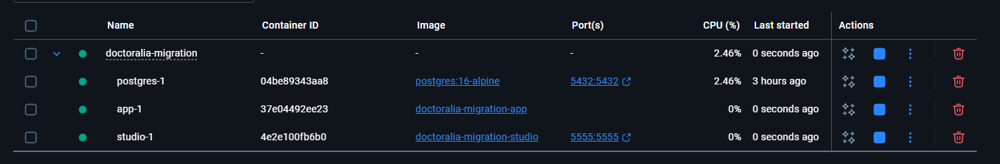
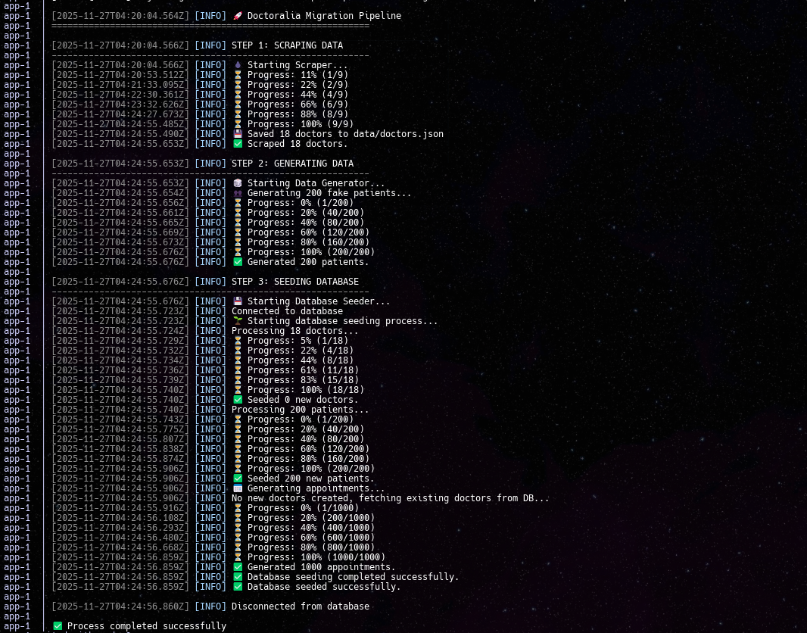
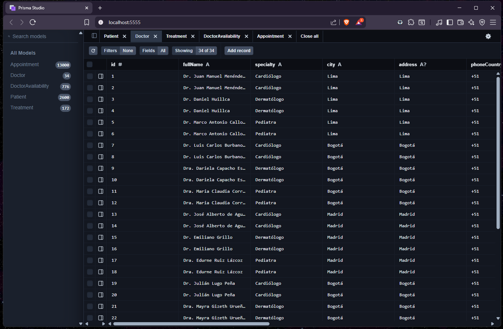
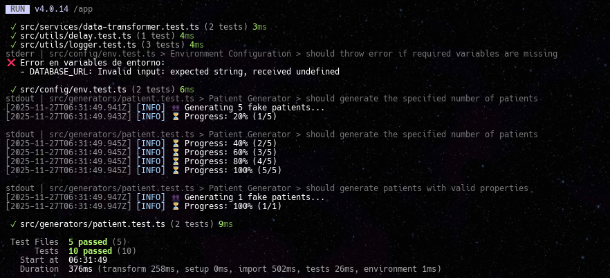

# Documentación Técnica Detallada: Doctoralia ETL Migration

Este proyecto es una solución automatizada para la extracción (scraping), transformación y carga de datos desde Doctoralia hacia una base de datos PostgreSQL. Diseñado para ser robusto, escalable y fácil de desplegar mediante Docker.

## 💡 Decisiones de Diseño: Enfoque Pragmático

He tomado decisiones técnicas deliberadas para resolver el problema de la manera más eficiente posible, evitando la sobreingeniería:

- **¿Por qué no NestJS?**: Aunque tengo experiencia construyendo APIs robustas con **NestJS**, este desafío es un proceso **ETL** (Extracción, Transformación, Carga), no un servicio web. Añadir NestJS hubiera introducido complejidad y _boilerplate_ innecesarios sin aportar valor real al objetivo de la migración.
- **¿Por qué TypeScript para todo?**: A menudo se usa Python para scraping, pero al mantener todo en **TypeScript** (Scraping + Scripting + ORM), logro una **coherencia de tipos total** y un flujo de desarrollo unificado, sin necesidad de cambiar de contexto o gestionar múltiples runtimes.
- **Uso Exclusivo de TypeScript**: He priorizado el uso de TypeScript para aprovechar su sistema de tipos estáticos, lo que reduce errores en tiempo de ejecución y mejora la mantenibilidad del código.

## ✨ Funcionalidades Destacadas

He diseñado este proyecto enfocándome en las mejores prácticas de ingeniería de software:

- **Arquitectura Modular**: Separación clara de responsabilidades (Scrapers, Generadores, Servicios).
- **Contenerización Completa**: Uso de Docker y Docker Compose para un entorno reproducible y aislado.
- **Pipeline ETL Automatizado**: Extracción, transformación y carga de datos sin intervención manual.
- **Manejo de Errores y Logs**: Sistema de logging detallado para monitorear cada paso del proceso.
- **Datos Realistas**: Generación de pacientes y citas coherentes para pruebas de calidad.
- **Calidad de Código**: Uso de **ESLint**, **Prettier** y **Husky** (pre-commit hooks) para garantizar un código limpio y consistente.
- **Pruebas Unitarias**: Suite de tests con **Vitest** para asegurar la robustez y fiabilidad de los componentes críticos.
- **Configuración Flexible**: Control total mediante variables de entorno.
- **Documentación Clara**: Guías paso a paso para facilitar la evaluación.

## 📋 Requisitos Previos

Antes de comenzar, asegúrate de tener instalado lo siguiente en tu sistema:

1.  **Docker Desktop**: Esencial para ejecutar el entorno contenerizado (Base de datos, App, Prisma Studio).
    
2.  **Git**: Para clonar el repositorio.
3.  **Terminal**: PowerShell (Windows) o Bash (Linux/Mac).

### ⚙️ Configuración Inicial

Antes de ejecutar cualquier comando, es **fundamental** configurar las variables de entorno:

1.  Copia el archivo de ejemplo:
    ```bash
    cp .env.example .env
    ```
2.  El archivo `.env` ya viene pre-configurado con valores por defecto listos para probar el proyecto.

---

## 🚀 Cómo Levantar el Proyecto

He simplificado el proceso de despliegue con scripts automáticos que manejan todo el ciclo de vida de la aplicación.

### Opción 1: Ejecución Automática (Recomendada)

Estos scripts levantan los servicios, ejecutan el pipeline de migración y abren automáticamente la interfaz de visualización de datos.

⏱️ **Tiempo de Ejecución:** ~2-3 minutos (optimizado con concurrencia paralela que procesa múltiples ciudades/especialidades simultáneamente, reduciendo el tiempo en 60-70% vs. enfoque secuencial)



**En Windows (PowerShell):**

```powershell
./start.ps1
```

_Si tienes problemas de permisos, ejecuta primero:_ `Set-ExecutionPolicy -Scope Process -ExecutionPolicy Bypass`

**En Linux / Mac:**

```bash
chmod +x start.sh
./start.sh
```

**Opciones Adicionales:**

Si ya has descargado los datos previamente y quieres ahorrar tiempo (y evitar peticiones a Doctoralia), puedes saltar el scraping (~15 segundos):

```powershell
# Windows
./start.ps1 -SkipScraping

# Linux/Mac
./start.sh --skip-scraping
```

### Opción 2: Ejecución Manual con Docker Compose

Si prefieres tener control total sobre los comandos:

1.  **Levantar servicios:**
    ```bash
    docker-compose up -d --build
    ```
2.  **Ver logs en tiempo real:**
    ```bash
    docker-compose logs -f app
    ```
3.  **Acceder a los datos:**
    Una vez finalizado, abre tu navegador en [http://localhost:5555](http://localhost:5555) para ver Prisma Studio.

---

## 🔄 Qué Hace el Pipeline de Migración

El sistema ejecuta un proceso ETL (Extract, Transform, Load) secuencial definido en `src/main.ts`:

### 1. Extracción (Scraping)

- **Tecnología**: Puppeteer (navegador headless) con **p-limit** para control de concurrencia.
- **Proceso**: Navega por Doctoralia buscando doctores según las ciudades y especialidades configuradas.
- **Detalles**: Extrae información detallada (nombre, especialidad, dirección, precio, servicios).
- **Concurrencia**: Procesa hasta 3 combinaciones de ciudad/especialidad **en paralelo** (configurable con `SCRAPING_CONCURRENCY`), reduciendo el tiempo de ejecución en ~60-70%.
- **Optimización Doble**:
  - **Nivel 1**: Scraping paralelo de múltiples ciudades/especialidades simultáneamente
  - **Nivel 2**: Scraping paralelo de perfiles de doctores dentro de cada búsqueda
- **Caché**: Los datos extraídos se guardan en `data/doctors.json`. Si se usa la opción de "Skip Scraping", el sistema lee directamente este archivo, haciendo el proceso instantáneo.

### 2. Generación de Datos (Mocking)

- **Tecnología**: Faker.js.
- **Proceso**: Genera pacientes ficticios con datos realistas (nombres, correos, teléfonos) para poblar el sistema y simular un entorno de producción real.
- **Volumen**: Configurable mediante variables de entorno (por defecto 200 pacientes).

### 3. Carga (Seeding)

- **Tecnología**: Prisma ORM con operaciones batch optimizadas y paralelismo.
- **Proceso**: Inserta relacionalmente los doctores extraídos y los pacientes generados en la base de datos PostgreSQL.
- **Optimizaciones Implementadas**:
  - **Paralelismo**: Generación de pacientes (Faker.js) + inserción de doctores se ejecutan simultáneamente usando `Promise.all`, ahorrando ~500ms.
  - **Batch Inserts**: Pacientes (200→1 query) y citas (1000→1 query) se insertan en operaciones masivas en lugar de loops individuales.
  - **Verificación Batch de Duplicados**: Doctores se verifican en una sola query (N queries → 1 query).
  - **Database Indexes**: Índices en columnas clave (`city`, `specialty`, `rating`, `email`, `createdAt`) para queries optimizadas.
  - **Ahorro Total**: ~9.5-10.5 segundos en operaciones de base de datos y generación de datos.
- **Relaciones**: Crea citas aleatorias vinculando pacientes con doctores para demostrar la integridad referencial del esquema.



---

## ⚠️ Limitaciones y Supuestos Importantes

Para la evaluación de esta prueba técnica, he tomado las siguientes consideraciones:

1.  **Rate Limiting y Ética de Scraping**:
    - El scraper usa concurrencia controlada (`SCRAPING_CONCURRENCY=3`) para optimizar rendimiento sin abusar del servidor.
    - **Limitación**: Por defecto, se extraen pocos doctores (`MAX_DOCTORS_PER_SEARCH=3`) para que la prueba sea rápida. Esto es configurable en el archivo `.env`.
    - **Rendimiento**: Con concurrencia paralela, el tiempo de scraping se reduce de ~5 minutos a ~2-3 minutos (mejora del 60-70%).

2.  **Persistencia de Datos**:
    - La base de datos vive en un volumen de Docker. Si borras el contenedor y el volumen, los datos se perderán.
    - El archivo `data/doctors.json` actúa como una caché persistente del scraping.

3.  **Validación de Datos**:
    - Se asume que la estructura HTML de Doctoralia se mantiene constante. Si Doctoralia cambia sus clases CSS, el scraper podría necesitar ajustes (típico en proyectos de scraping).

4.  **Entorno de Ejecución**:
    - El proyecto asume que los puertos `5432` (Postgres) y `5555` (Prisma Studio) están libres en tu máquina host.

---

## ⚙️ Configuración Avanzada (.env)

Puedes ajustar el comportamiento editando el archivo `.env`:

| Variable                       | Descripción                               | Default                           |
| ------------------------------ | ----------------------------------------- | --------------------------------- |
| `SCRAPING_CITIES`              | Ciudades a buscar (separadas por coma)    | `Lima,Bogotá,Madrid`              |
| `SCRAPING_SPECIALTIES`         | Especialidades a buscar                   | `Cardiólogo,Dermatólogo,Pediatra` |
| `SCRAPING_CONCURRENCY`         | Número de tareas paralelas (1-10)         | `3`                               |
| `MAX_DOCTORS_PER_SEARCH`       | Máximo de doctores a extraer por búsqueda | `3`                               |
| `MAX_SERVICES_COUNT`           | Máximo de servicios a extraer por doctor  | `5`                               |
| `MAX_AVAILABILITY_SLOTS_COUNT` | Máximo de horarios a extraer por doctor   | `5`                               |
| `PATIENTS_COUNT`               | Cantidad de pacientes falsos a generar    | `200`                             |
| `APPOINTMENTS_COUNT`           | Cantidad de citas a generar               | `1000`                            |
| `SCRAPING_DELAY_MS`            | Retraso entre peticiones (ms)             | `1500`                            |

> [!IMPORTANT]
> **Nota sobre Uso Responsable:**
> Las configuraciones por defecto (especialmente `MAX_DOCTORS_PER_SEARCH=3`) están diseñadas intencionalmente para un **uso controlado**.
>
> El objetivo es realizar una prueba técnica funcional **sin saturar ni afectar la disponibilidad de la página de Doctoralia**. Por favor, mantén estos valores bajos durante las pruebas para ser respetuosos con el servidor destino.

---

## 🛠️ Scripts de Desarrollo

El proyecto utiliza **pnpm** como gestor de paquetes. Los scripts están definidos en `package.json`:

| Script          | Comando                  | Descripción                                                        |
| --------------- | ------------------------ | ------------------------------------------------------------------ |
| `start`         | `pnpm start`             | Ejecuta el pipeline principal (`src/main.ts`).                     |
| `generate:data` | `pnpm run generate:data` | Ejecuta el **scraping** y guarda los datos en `data/doctors.json`. |
| `build`         | `pnpm run build`         | Compila el código TypeScript a JavaScript.                         |
| `lint`          | `pnpm run lint`          | Analiza el código en busca de errores con ESLint.                  |
| `format`        | `pnpm run format`        | Formatea todo el código automáticamente con Prettier.              |
| `prepare`       | `pnpm run prepare`       | Configura los hooks de Husky.                                      |
| `test`          | `pnpm run test`          | Ejecuta la suite de pruebas unitarias con **Vitest**.              |

> [!TIP]
> **Ejecución con Docker:**
> Dado que el entorno está contenerizado, se recomienda ejecutar estos scripts **dentro del contenedor** para asegurar que todas las dependencias del sistema estén disponibles.
>
> ```bash
> # Ejemplo: Ejecutar el scraping manualmente dentro del contenedor 'app'
> docker-compose run --rm app pnpm run generate:data
>
> # Ejemplo: Ejecutar los tests
> docker-compose run --rm app pnpm test
> ```
>
> 

---

## 📬 Contacto

**Anthoni Portocarrero Rodriguez**
[LinkedIn](https://www.linkedin.com/in/anthoni-portotocarrero-rodriguez-06089119a)
[Website](https://www.anthonidev.site)
